# Stock Market Prediction using Numerical and Textual Analysis

## Overview
This repository presents a hybrid model for predicting stock prices by leveraging numerical analysis of historical stock prices and textual analysis of news headlines. The primary objective of this project is to develop an effective approach that combines both quantitative and qualitative factors to enhance stock price/performance prediction.

## Features
- Data preprocessing
- Data Visualization
- Time Series Analysis
- Implementation of various machine learning models
- Evaluation of model performance
- Prediction visualization
- Understanding Important Aspects

## Requirements
- Python (version 3.9.16)
- Libraries:
  - pandas
  - numpy
  - scikit-learn
  - xgboost
  - nltk
  - matplotlib
  - seaborn
  - tensorflow
  - keras

## Installation
1. Clone the repository:
   ```
   git clone https://github.com/snehajha-coder/Stock-Market-Prediction.git
   ```
2. Install the required libraries:
   ```
   pip install -r requirements.txt
   ```

## Usage
1. Download the Jupyter Notebook file (ipynb) from the repository.

2. Open the Jupyter Notebook in your preferred Python environment.

3. Modify the code according to your requirements:
   - Update the data sources and file paths as per your dataset.
   - Customize the data preprocessing steps based on your specific needs.
   - Adjust the machine learning models or algorithms as desired.
   - Modify the visualization code to suit your preferences.

4. Ensure that you have all the necessary libraries installed:
   - Install the required libraries by running the following command in a code cell:
     ```
     !pip install library_name
     ```
   - Replace "library_name" with the actual name of the library if it is not already installed.

5. Execute the code cells in the Jupyter Notebook to run the entire code or specific sections as needed:
   - Use the "Run" button or press "Shift + Enter" to execute a code cell.
   - Follow the instructions and prompts provided within the code for any user inputs or interactions.

6. View the output, predictions, and evaluation results directly in the Jupyter Notebook:
   - The output will be displayed in the output cells below the corresponding code cells.
   - Evaluate the performance of the models and analyze the predicted stock prices or performance.

7. Customize the code and experiment with different settings or approaches to further refine the predictions:
   - Modify the parameters of the machine learning models.
   - Try different feature engineering techniques or preprocessing methods.
   - Explore alternative algorithms or models to enhance the predictions.

8. Save your modifications and the output generated from the Jupyter Notebook for future reference and analysis.

Note: Ensure that you have the required dataset available and properly formatted before running the code. Modify the code and adapt it to your specific dataset and analysis objectives.

By following these steps and modifying the provided Jupyter Notebook code, you can leverage the stock market prediction functionality according to your specific needs and dataset.

## Steps Involved


### Data Collection
To gather the necessary data for Stock Market Prediction using Numerical and Textual Analysis, the following steps were followed:

1. Historical Stock Price Data:
   - The historical stock price data was collected from Yahoo Finance.
   - Yahoo Finance provides a comprehensive and reliable source of historical stock price information for various stocks.
   - The data includes the date, open price, close price, high price, low price, and volume traded for each trading day.

2. News Headlines and Articles:
   - News headlines and articles related to the target stock were collected using two APIs: newsAPI and BingNewsAPI.
   - These APIs allow access to a wide range of news sources and provide relevant news content for analysis.
   - In addition, the dataset available at [this website](https://dataverse.harvard.edu/dataset.xhtml?persistentId=doi:10.7910/DVN/DPQMQH) was used.

Note: It is important to ensure the proper usage and compliance with the terms and conditions of the APIs used for data collection.

### 2. Data Preprocessing
1. Stock Price Data:
   - The dataset has 5303 entries with 8 columns: Date, Open, High, Low, Close, Volume, Dividends, and Stock Splits.
   - There are no missing values in the dataset.
   - Descriptive statistics of the data show summary statistics for each column.
   - Two stock split events were identified on February 12, 2004, and July 15, 2015.

2. Adjusting for Stock Splits and Dividends:
   - The code adjusts the stock prices for stock splits and dividends to accurately reflect the true value of the stock.
   - The 'Stock Splits' column is replaced with 1 where the value is 0 to avoid division errors.
   - The adjusted close prices are calculated by dividing the 'Close' prices by the cumulative product of the 'Stock Splits' column.
   - Dividend amounts are subtracted from the adjusted close prices to account for the impact of dividends.
   - The unnecessary columns are dropped, and the resulting DataFrame ('data_preprocessed') contains the adjusted close prices.

3. Preprocessing News Headlines for Sentiment Analysis:
   - The code demonstrates text preprocessing techniques applied to news headlines for sentiment analysis.
   - The 'preprocess_text' function is defined to tokenize, remove stopwords, perform stemming, and lemmatize the text.
   - The function is applied to the 'Headline' column in the 'news_api_netfix_data' and 'bing_netfilx_data' DataFrames.
   - Preprocessed headlines are stored in the 'Headline_preprocessed' column.

4. Making Indian News Headlines Data Short:
   - Duplicates are dropped from the 'india_news_headlines' DataFrame.
   - The 'publish_date' column is converted to the 'datetime' data type.
   - The DataFrame is filtered to include only the 'publish_date' and 'headline_text' columns.
   - News headlines are grouped by date, joining them into a single string per date.
   - The 'publish_date' column is set as the index.
   - The data is sorted by date in ascending order.
   - Finally, the 'publish_date' column is reset as a regular column.

### 3. Numerical Analysis
Perform exploratory data analysis (EDA) on the historical stock price data to understand trends, patterns, and relationships.
Extract important features such as moving averages, relative strength index (RSI), and other technical indicators.
Split the data into training and testing sets.

Here's a breakdown of your code and its functionality:

#### 1. Plotting Closing Price of Netflix:
   - The code uses matplotlib to plot the closing price of Netflix stock over time.
   - The plot includes vertical lines indicating the dates when the stock was split into multiple parts.
   - The stock split dates are obtained from the "stock_split_days" dataframe.
   - The plot also includes text annotations for the stock split dates.
   - The closing price data is retrieved from the "data_nflx" dataframe.

  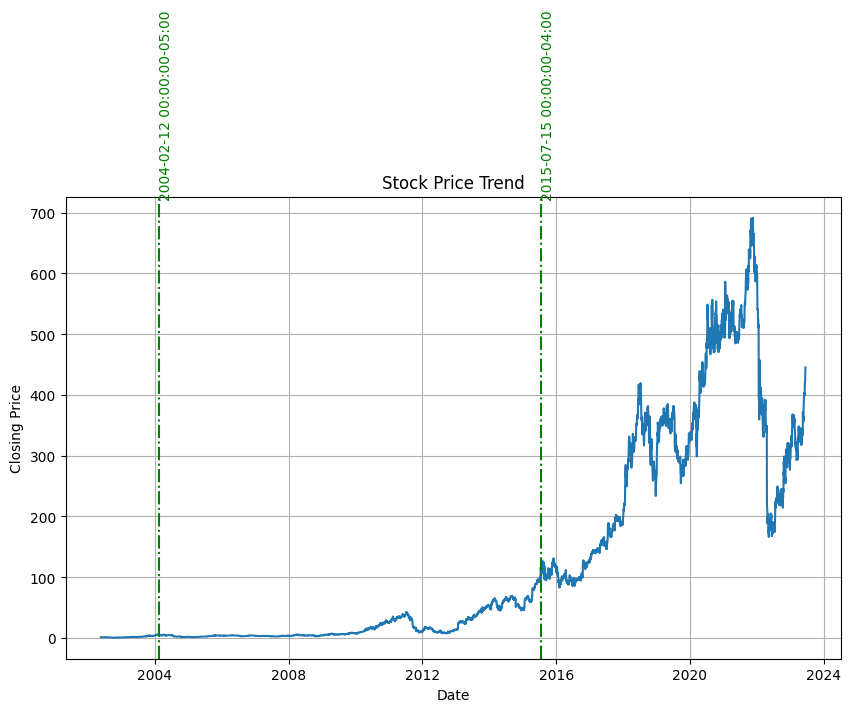


#### 2. Plotting Adjusted Closing Price:
   - The code plots the adjusted closing price of Netflix stock over time.
   - The plot is similar to the previous one, but with adjusted closing prices.
   - The adjusted closing price accounts for events like stock splits and dividends.

  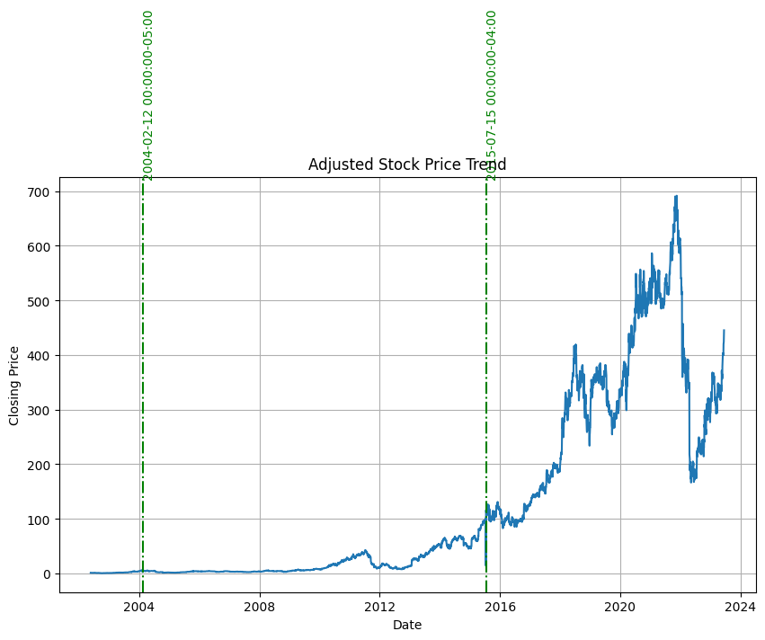

#### 3. Comparing Trends with Competitors:
   - The code defines a function called "plot_closing_values" that takes a list of stock tickers as input.
   - It fetches the historical stock price data for each ticker symbol using the yfinance library.
   - The closing values for each ticker are plotted on the same graph, using different colors for each ticker.
   - In your example, the tickers used are 'NFLX' (Netflix), 'DIS' (Disney), and 'T' (AT&T).

  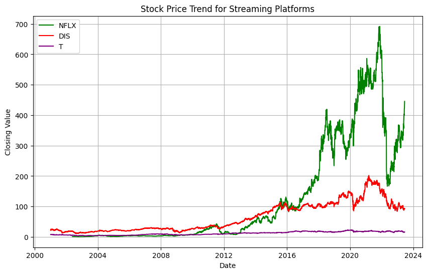 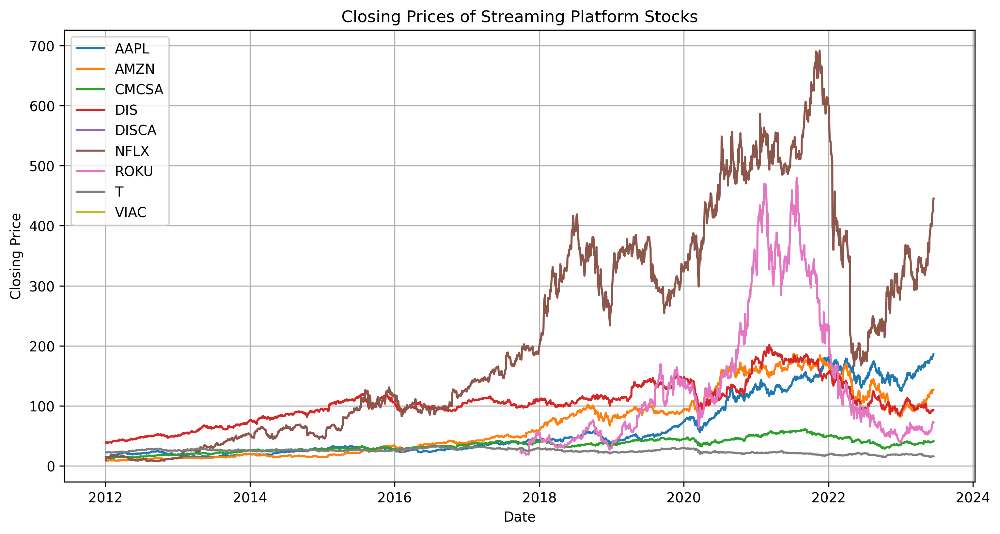

#### 4. Plotting Moving Averages:
   - The code calculates and plots the moving averages for the closing price of Netflix stock.
   - Two moving averages are calculated: SMA 50 (Simple Moving Average with a window of 50) and SMA 200.
   - The closing prices and moving averages are plotted on the same graph.

  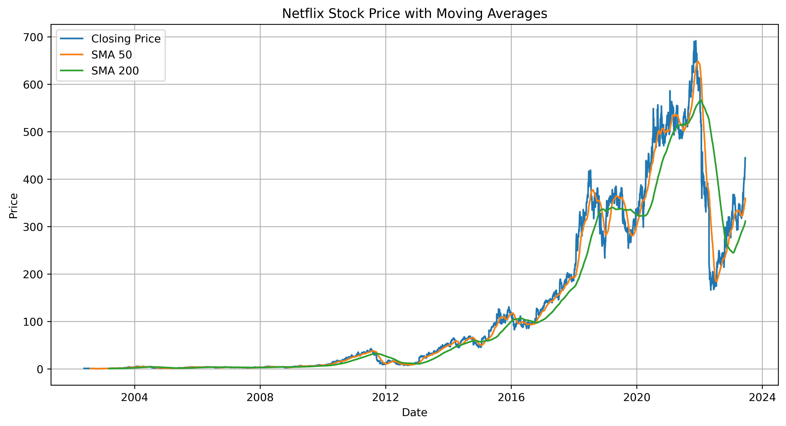

#### 5. Plotting Candlestick Chart:
   - The code uses mplfinance library to plot a candlestick chart for Netflix stock.
   - The candlestick chart provides information about the opening, closing, high, and low prices of the stock for each day.
   - The chart also includes volume bars.

  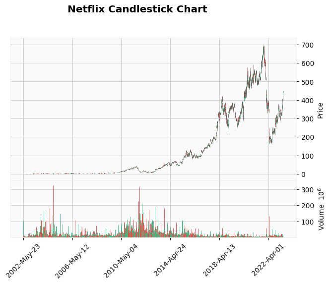 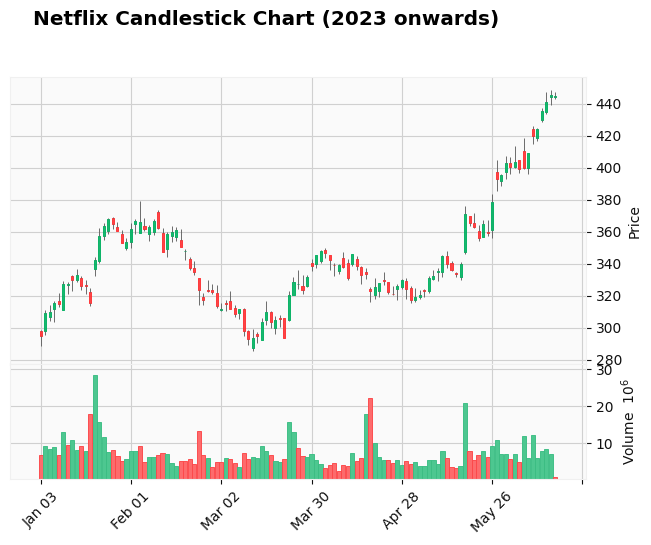

#### 6. Plotting Support and Resistance Levels:
   - The code plots the closing price of Netflix stock and adds support and resistance levels to the plot.
   - Support and resistance levels are predefined values indicating potential levels where the stock price might reverse.
   - The support levels are represented by green horizontal lines, and the resistance levels are represented by red horizontal lines.

  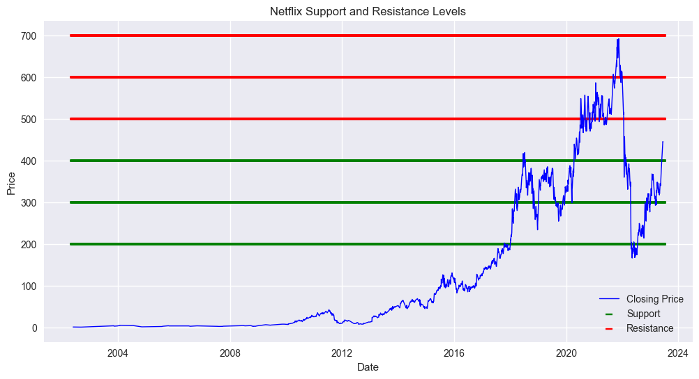

#### 7. Correlation Analysis:
   - The code calculates the correlation coefficients between the 'Close', 'Volume', 'Open', and 'Adjusted Close' columns of the Netflix stock data.
   - The correlation matrix is printed to show the relationships between these variables.

  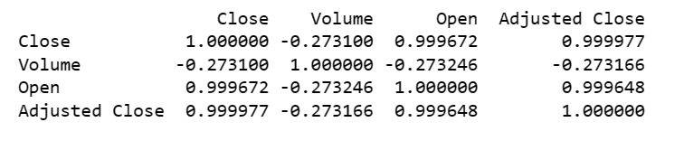


#### 8. Autocorrelation Analysis:
   - The code uses the plot_acf function from the statsmodels library to plot the autocorrelation function (ACF) for the 'Close' prices of Netflix stock.
   - The ACF measures the correlation between the stock price at a given time and its previous values at different lags.
   - The plot helps identify any significant patterns or dependencies in the stock price data.

  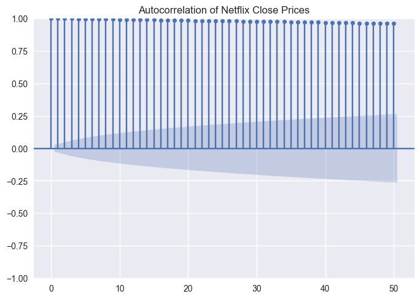 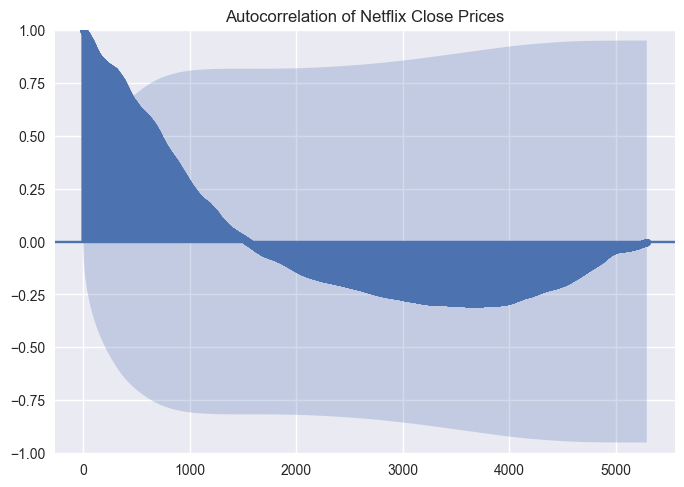

#### 9. Yearly Aggregated Trend:
   - The code groups the Netflix stock data by year and calculates the average opening and closing prices, as well as the total volume for each year.
   - The yearly aggregated trend is then plotted, showing the average closing price for each year.

  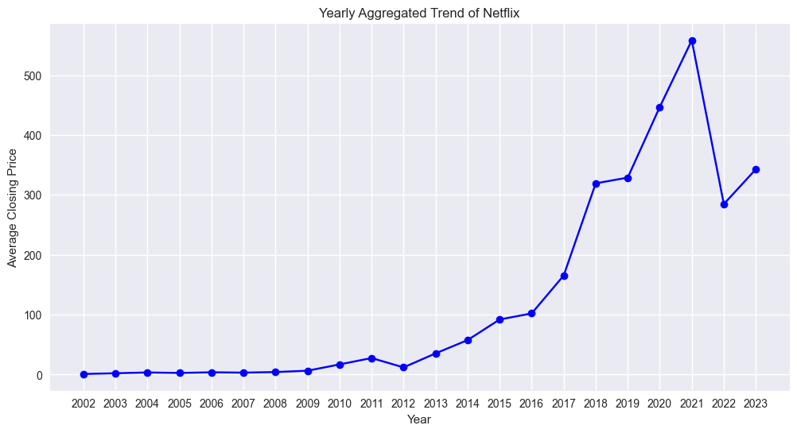 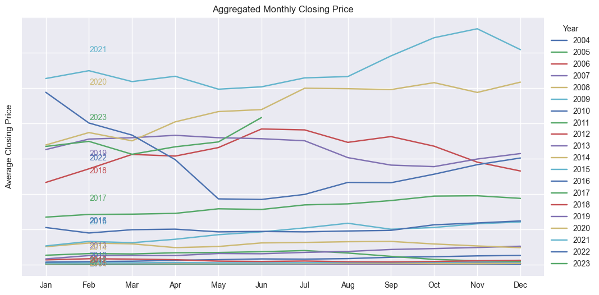

#### 10. Monthly Aggregated Trend:
   - The code filters the Netflix stock data to include only data from 2004 onwards.
   - The data is then grouped by year and month, and the average opening and closing prices, as well as the total volume, are calculated for each month.
   - The monthly aggregated trend is plotted, showing the average closing price for each month, with different colors for each
  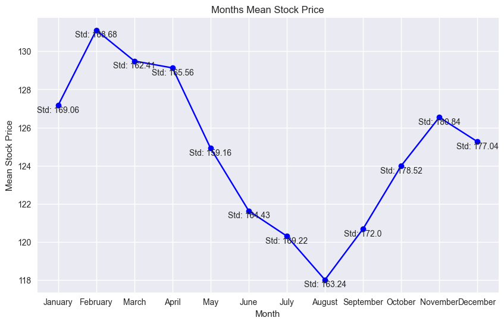

#### 11. Calculating Daily Returns and Volatility:
   - We calculate the daily returns of Netflix stock by using the percentage change in the closing price.
   - The volatility is then calculated as the standard deviation of the daily returns.
   - The volatility is plotted over time, using a 30-day rolling window for smoothing.

   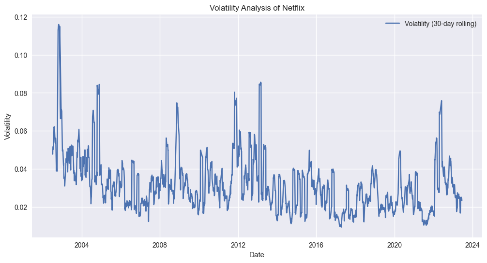

#### 12. Analyzing Weekday Mean Stock Price:
   - We group the stock price data by weekdays (Monday to Friday) and calculate the mean and standard deviation of the stock price for each weekday.
   - The mean stock prices are plotted, and the standard deviations are displayed as text annotations.

   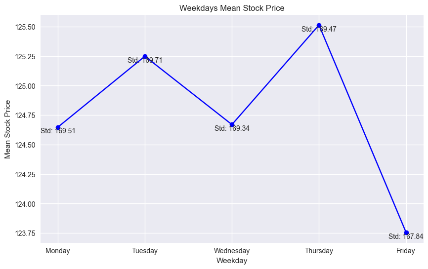

#### 13. Performing Seasonal Decomposition:
   - We apply seasonal decomposition to the closing price data using the statsmodels library.
   - The decomposition separates the data into trend, seasonal, and residual components.
   - The components are plotted individually to visualize their patterns and contributions.

   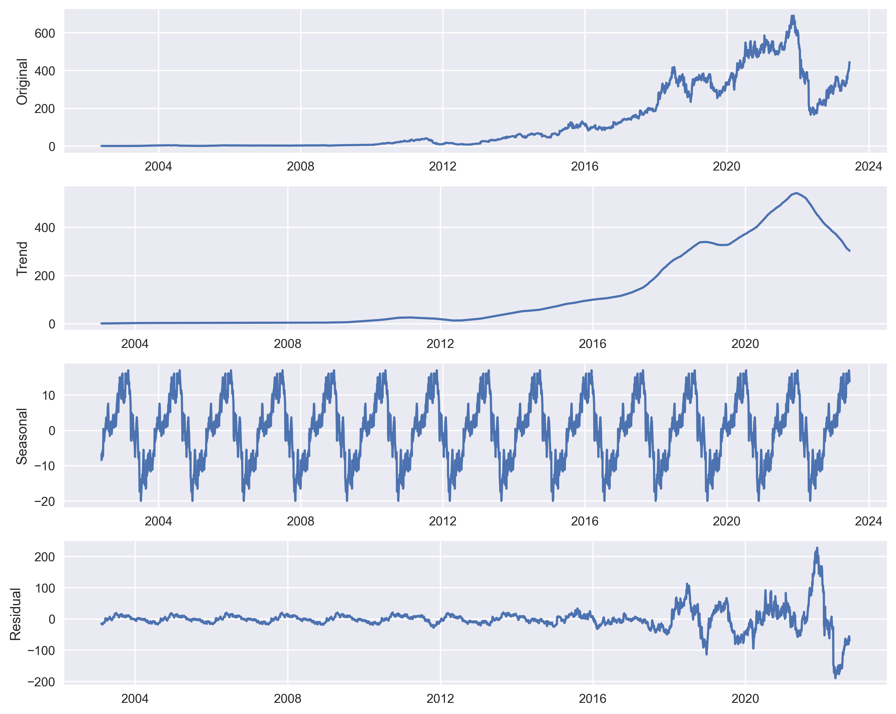


### 4. Textual Analysis
## Textual Analysis

In this section, we perform textual analysis on the news headlines related to Netflix. We aim to understand the sentiment expressed in these headlines using two different approaches: TextBlob and VADER sentiment analysis.

### TextBlob Sentiment Analysis

We utilize the TextBlob library to perform sentiment analysis on the preprocessed headlines. The sentiment analysis is performed as follows:

1. Sentiment Classification:
   - Each headline is processed using TextBlob to determine its sentiment polarity, which can be positive, negative, or neutral.
   - The sentiment polarity is categorized into 'Positive,' 'Negative,' or 'Neutral' based on the polarity score.

The resulting sentiment classification is then added as a new column in the DataFrame. The updated DataFrame is saved as 'news_api_netfix_data_sentiment.csv'.

### VADER Sentiment Analysis

We employ the VADER (Valence Aware Dictionary and sEntiment Reasoner) sentiment analysis tool from the NLTK library. The sentiment analysis is performed as follows:

1. Sentiment Score Calculation:
   - The VADER sentiment analyzer is initialized.
   - A custom function is created to calculate the sentiment score for each headline using the compound score returned by VADER.

The sentiment scores are then added as a new column in the DataFrame.

### Sentiment Analysis Visualization

To visualize the sentiment analysis results, we plot the sentiment scores against the corresponding dates:

- Sentiment Score vs Date: A line plot that displays the sentiment scores over time for the headlines.
-   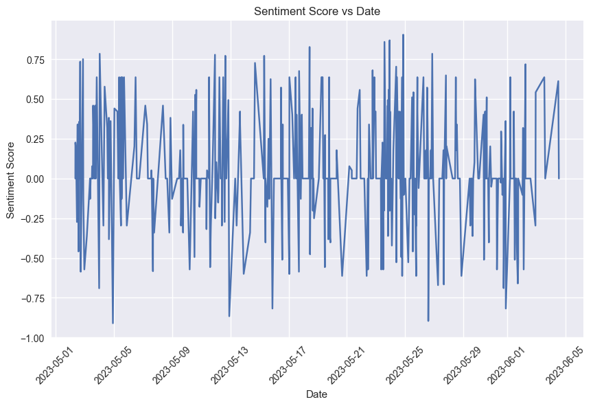


Additionally, we calculate the daily mean sentiment score and plot it as follows:

- Daily Mean Sentiment Score: A line plot that shows the average sentiment score for each day based on the headlines.
-   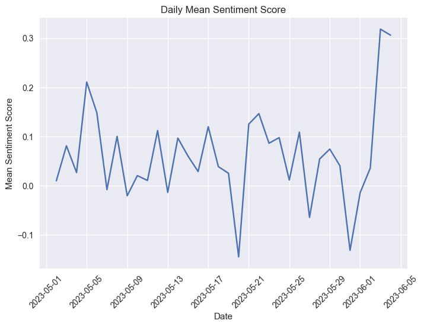


These visualizations provide insights into the overall sentiment expressed in the news headlines related to Netflix.

### 5. Feature Integration
To combine the textual data (news headlines) with the numerical data (stock market information), follow these steps:

1. Load the textual data: The code loads the news headlines data from a CSV file called 'india-news-headlines_preprocessed_merged.csv'. It selects only the necessary columns, which are the publication date and the preprocessed headline text.

2. Load the numerical data: The code loads the stock market data from a CSV file called 'data_nflx.csv'. It converts the 'Date' column to the proper date format.

3. Merge the datasets: The code merges the textual and numerical datasets based on the date. This combines the news headlines with the corresponding stock market information.

4. Remove unnecessary columns: The code removes unnecessary columns from the combined dataset. Specifically, it drops the 'publish_date', 'Close', 'Returns', and 'Dividends' columns.

5. Rename columns (if necessary): If there is an unnamed column in the combined dataset, the code renames it to 'Date' for clarity.

6. Save the combined data: The code saves the combined dataset to a new CSV file called 'final_data_combined_v01.csv'.

7. Visualize the correlation: The code generates a heatmap to visualize the correlation between different columns in the combined dataset. This helps identify any relationships or patterns between the stock market data and the sentiment scores of the news headlines.
     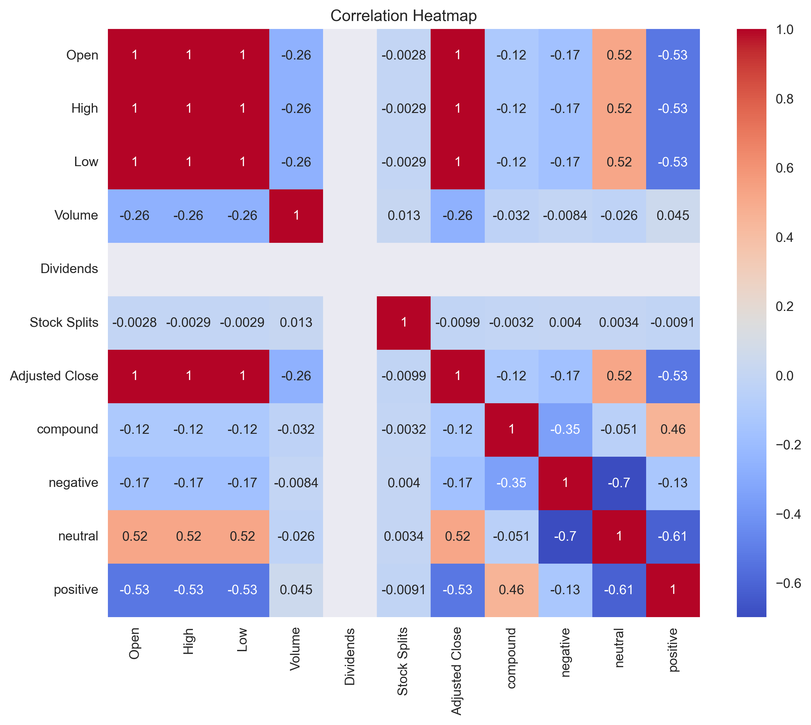


### 6. Model Training and Evalulation
#### Time series modeling and forecasting of Stock-Price
The code provided demonstrates different methods for time series modeling and forecasting using Python. Here's a breakdown of each section:

1. Univariate Modeling with ARIMA:
   - The code imports the necessary libraries and modules for ARIMA modeling.
   - It splits the data into training and testing sets using `temporal_train_test_split`.
   - It creates an ARIMA model with the specified order and fits it to the training data.
   - It generates forecasts for the test data using the trained model.
   - It calculates performance metrics such as Mean Absolute Error (MAE), Root Mean Squared Error (RMSE), and Mean Absolute Percentage Error (MAPE).
   - Finally, it prints the calculated error metrics.

2. Exponential Smoothing (ETS):
   - The code imports the required modules for exponential smoothing.
   - It splits the data into training and testing sets using `temporal_train_test_split`.
   - It creates an ExponentialSmoothing model with the specified trend and seasonality parameters and fits it to the training data.
   - It generates forecasts for the test data.
   - It calculates the MAE, RMSE, and MAPE metrics for the forecasts.
   - Finally, it prints the calculated error metrics.
   - 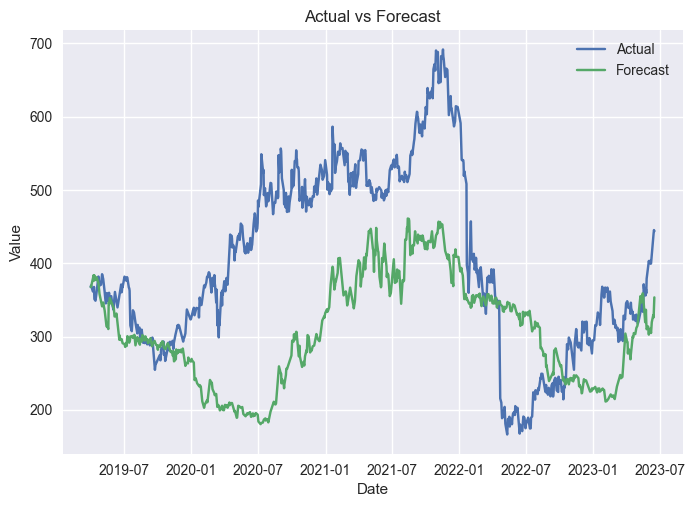


3. Finding the Best Value for Seasonality:
   - The code defines a function to calculate the MAE for a given seasonality value in exponential smoothing.
   - It assigns a seasonality value and calculates the MAE using the function.
   - Finally, it prints the MAE for the given seasonality value.
   - 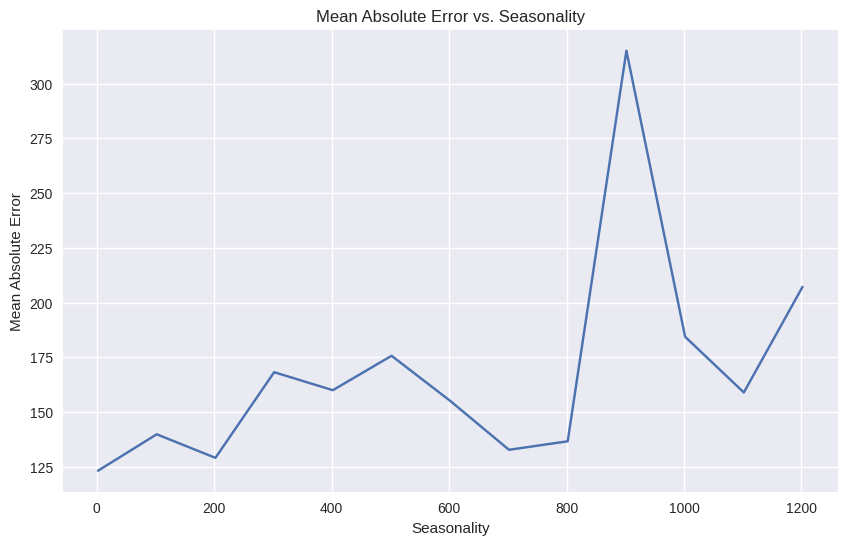

4. Multivariate Modeling:
   - The code demonstrates multivariate modeling using an LSTM model.
   - It imports the necessary libraries and modules for LSTM modeling.
   - It prepares the data by scaling and splitting it into training and testing sets.
   - It defines an LSTM model and trains it on the training sequences.
   - It evaluates the model on the test sequences and makes predictions.
   - It denormalizes the predicted prices and visualizes the actual and predicted stock prices using a plot.
   - 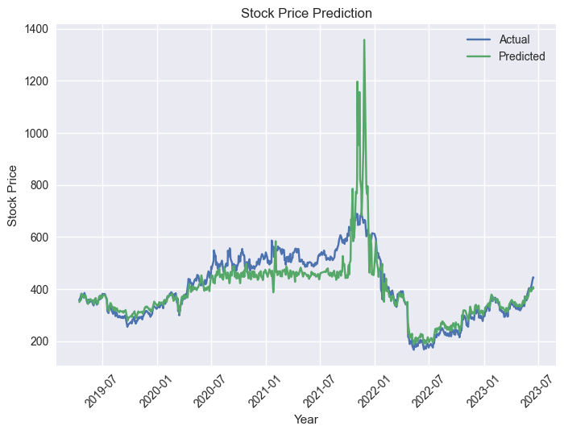

5. Alternative LSTM Modeling:
   - The code demonstrates an alternative approach to LSTM modeling using TensorFlow.
   - It imports the necessary libraries and modules.
   - It preprocesses the data by normalizing it and splitting it into training and testing sets.
   - It creates input sequences and labels for training.
   - It builds and trains an LSTM model on the training data.
   - It makes predictions on the test data and evaluates the model's performance.
   - Finally, it visualizes the actual and predicted values using a plot.
   - 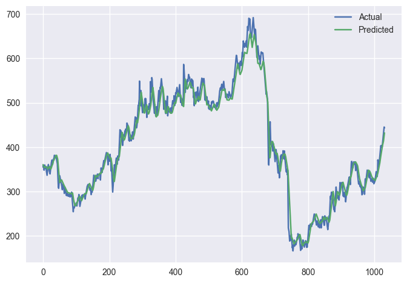

Each section provides a different approach to time series modeling and forecasting, allowing you to compare and choose the method that best suits your needs.

Note: Each of the model is predicting stock prices but one must remember that we don't want to predict how close price is to over prediction. We want to know weather making investment on that particular day is helpful or not. So here are other approches used to find wheather on that day is good to make investment or not

#### Classification models
Classification models where made to pridict weather we will get profit or loss if we invest on that day. I made one new colunm in my dataset with name 'Target' whcih was 0 or 1. 0 when it was not good to invest on that day and it was 1 when it was good to invest. I used various advanced classification models and predicted the results.

Below are descriptions and results of some of the models used

1. Logistic Regression:
   - Features (X) and target variable (y) were separated.
   - The dataset was split into training and testing sets.
   - Logistic regression model was created and fitted to the training data.
   - Target variable was predicted for the test set.
   - Model performance metrics were calculated, including accuracy, recall, precision, and classification report.
   - The accuracy was found to be 0.502, indicating poor performance in predicting investment profitability.

2. Random Forest Classifier:
   - Features (X) and target variable (y) were separated.
   - The dataset was split into training and testing sets.
   - Random Forest classifier was created and fitted to the training data.
   - Target variable was predicted for the test set.
   - Model performance metrics were calculated, including accuracy, recall, precision, and classification report.
   - The accuracy was found to be 0.496, indicating similar performance to logistic regression.

3. Random Forest Classifier with Hyperparameter Tuning:
   - Features (X) and target variable (y) were separated.
   - The dataset was split into training and testing sets.
   - Random Forest classifier was created with hyperparameters to tune.
   - Randomized search with cross-validation (CV) was performed to find the best hyperparameters.
   - The best model and its hyperparameters were obtained.
   - Target variable was predicted for the test set using the best model.
   - Model performance metrics were calculated, including accuracy, recall, precision, and classification report.
   - The accuracy was found to be 0.491, similar to the previous models.
   - The best hyperparameters were determined as {'n_estimators': 200, 'min_samples_split': 2, 'min_samples_leaf': 1, 'max_features': 'sqrt', 'max_depth': 5}.

Similarly I used many other methods like Gradient Boosting Classifier, Support Vector Machines, MLPClassifiers and many such also performed hyperparameters tuning on them. But acuracy of prediction was always close to zero. The prediction was not as easy I thought. 


### 9. Iterative Improvement
I tried to perform analysis with my recent news data as well. Constrain of resources resulted to so poor prediction. Still there are many ideas in my mind but for that I would need resources like proper news data related to any specific domain of any time. Maybe subscrption of newsAPI would help me a lot in this process. But till then. I have to rely on qualitaive analysis insted of quantitative.


## Results
Currently Netflix is using diffrent Strategies to tackel the problems, its always innovating. Also its news account blocking in help them to gain profit. I feels that its not easy that netflix might break down and one can trust to invest their stock in it.

## Contributing
Contributions to this project are welcome. If you find any bugs or have suggestions for improvements, please open an issue or submit a pull request.
